INTRODUCCION
======

En el proyecto 1 se va analizar los distintos casos con parametros y condiciones de borde con el fin de observar el estudio del comportamiento  del calor en el hormigon masivo en una dimension.

Casos
==========
Caso 1:
```


Largo (L)
1 m
Subdivisiones
100
Conductividad Térmica (k)
5,5 m^2/s
Calor Específico (c)
900 j/Kg°c
Densidad Hormigón
2400 Kg/m^3
dt
1 s
Condición de borde k=0
10 °c
Condición de borde final k=n
25 °c
Condiciones iniciales u0(x)
10*exp(-(x-0.5)**2/0.1**2)


```
Caso 2:
```


Largo (L)
1 m
Subdivisiones
300
Conductividad Térmica (k)
5,5 m^2/s
Calor Específico (c)
900 j/Kg°c
Densidad Hormigón
2400 Kg/m^3
dt
1 s
Condición de borde k=0
10 °c
Condición de borde final k=n
25 °c
Condiciones iniciales u0(x)
10*exp(-(x-0.5)**2/0.1**2)


```
Caso 3:
```


Largo (L)
1 m
Subdivisiones
300
Conductividad Térmica (k)
5,5 m^2/s
Calor Específico (c)
1100 j/Kg°c
Densidad Hormigón
2400 Kg/m^3
dt
1 s
Condición de borde k=0
10 °c
Condición de borde final k=n
25 °c
Condiciones iniciales u0(x)
10*exp(-(x-0.5)**2/0.1**2)


```
Caso 4:
```


Largo (L)
1 m
Subdivisiones
100
Conductividad Térmica (k)
10,5 m^2/s
Calor Específico (c)
1100 j/Kg°c
Densidad Hormigón
2400 Kg/m^3
dt
1 s
Condición de borde k=0
10 °c
Condición de borde final k=n
25 °c
Condiciones iniciales u0(x)
10*exp(-(x-0.5)**2/0.1**2)


```
Caso 5:
```


Largo (L)
1 m
Subdivisiones
100
Conductividad Térmica (k)
10.5 m^2/s
Calor Específico (c)
1100 j/Kg°c
Densidad Hormigón
2400.0 Kg/m^3
dt
1 s
Condición de borde k=0
10 °c
Condición de borde final k=n
25 °c
Condiciones iniciales u0(x)
10*exp(-(x-0.5)**2/0.1**2)


```
Caso 6:
```


Largo (L)
1 m
Subdivisiones
100
Conductividad Térmica (k)
5,5 m^2/s
Calor Específico (c)
900 j/Kg°c
Densidad Hormigón
1600 Kg/m^3
dt
1 s
Condición de borde k=0
0 °c
Condición de borde final k=n
20 °c
Condiciones iniciales u0(x)
10*exp(-(x-0.5)**2/0.1**2)


```
Caso 7:
```


Largo (L)
1 [m]
Subdivisiones
100
Conductividad Térmica (k)
5,5m^2/s
Calor Específico (c)
900j/Kg°c
Densidad Hormigón
2400Kg/m^3
dt
1 s 
Condición de borde k=0
30 °c
Condición de borde final k=n
5 °c
Condiciones iniciales u0(x)
10*exp(-(x-0.5)**2/0.1**2)


```
Caso 8:
```


Largo (L)
1 m
Subdivisiones
100
Conductividad Térmica (k)
5,5 m^2/s
Calor Específico (c)
900 j/Kg°c
Densidad Hormigón
2400 kg/m^3
dt
4 s
Condición de borde k=0
0 °c
Condición de borde final k=n
20 °c
Condiciones iniciales u0(x)
10*exp(-(x-0.5)**2/0.1**2)


```
Caso 9:
```


Largo (L)
1
Subdivisiones
100
Conductividad Térmica (k)
5,5
Calor Específico (c)
900
Densidad Hormigón
2400
dt
1
Condición de borde k=0
0
Condición de borde final k=n
20
Condiciones iniciales u0(x)
10*exp(-(x-0.5)**2/0.3**2)


```
Caso 10:
```

Largo (L)	1m
Subdivisiones	100
Conductividad Térmica (k)	5,5 m^2/s
Calor Específico (c)	900 j/Kg°c
Densidad Hormigón	2400 Kg/m^3
dt	1 s
Condición de borde k=0	0 °c
Condición de borde final k=n	30 °c
Condiciones iniciales u0(x)	5+10*exp(-(x-0.5)**2/0.1**2)


```
RESULTADOS
========

Output de la consola 1:

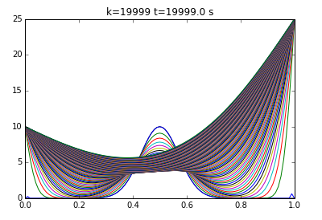


Output de la consola 2:
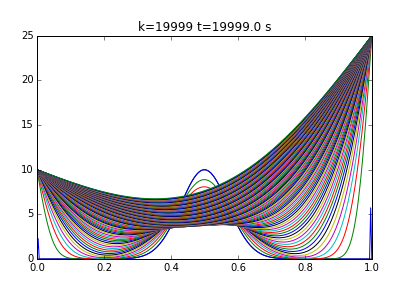
```
2

```
Output de la consola 3:
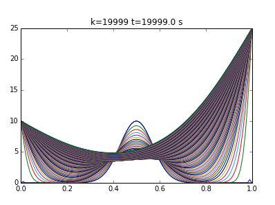
```
3

```
Output de la consola 4:
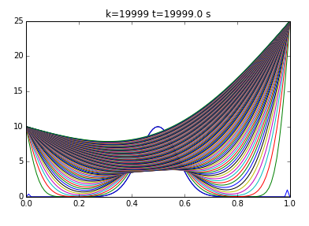
```
4

```
Output de la consola 5:
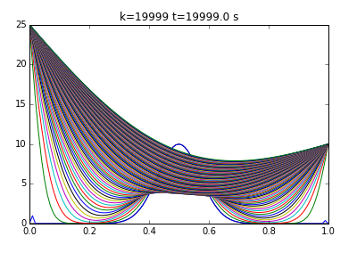
```
5

```
Output de la consola 6:
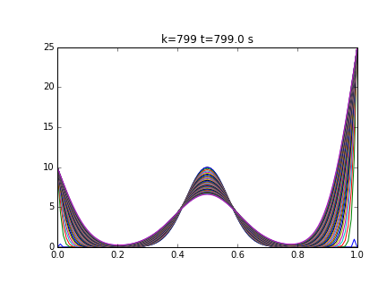
```
6

```
Output de la consola 7:
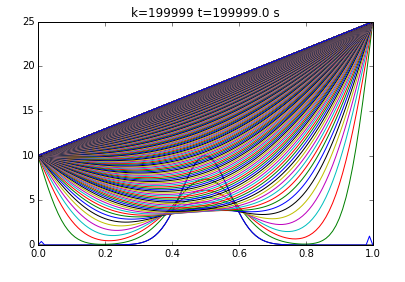
```
7

```
Output de la consola 8:
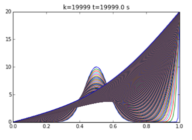
```
8

```
Output de la consola 9:

```
9

```
Output de la consola 10:
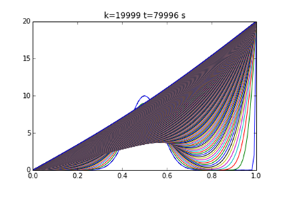
```
10

```

Output de la consola 11:
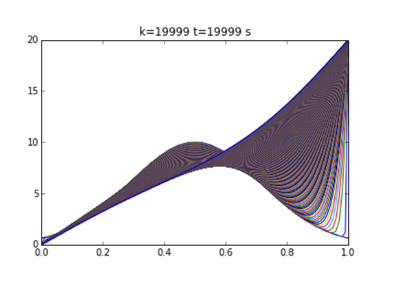


Output de la consola 12:
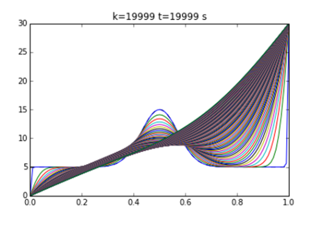

Recursos
==========

https://www.dropbox.com/s/9ugea32ulu186oi/2019%2C%20Methodology%20Comparison%20for%20Concrete%20Adiabatic%20Temperature%20Rise%20%28Riding%20et%20al.%29.pdf?dl=0

